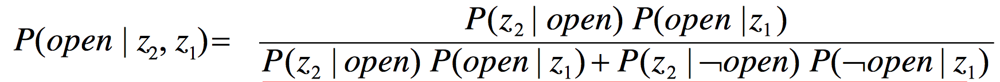

### CHAP 4: PROBABILISTIC ROBOTICS

- $Pr(A\vee B)=PR(A)+Pr(B)-Pr(A\wedge B)$

- $P(x)=\sum_y P(x,y)$ 和    $p(x)=\int p(x, y) dy$

- $P(x, y) = P(x | y)P( y) = P( y | x)P(x)$

$$
P(x|y)= \frac{P(x,y)}{ P(y)}=\frac{P( y | x) P(x)}{P( y)}=\frac {likehood\cdot prior}{evidence}
$$
- Bayes Rule with Background Knowledge：
$$P(x | y, z) =\frac {P( y | x, z) P(x | z)}{P( y | z)}$$
#### Conditional Independence:
- $P(x, y | z) = P(x | z)P( y | z)$ is equal to $P(x|z) = P(x | z, y)$ and $P( y|z) = P( y | z, x)$

but not $P(x, y ) = P(x)P( y)$ which is real independence.

- $P(z)=P(z | open) p(open) + P(z | \urcorner open) p(\urcorner open)$
#### Markov assumption:
z n is independent of z 1 ,...,z n-1 if we know x（set z~ as background knowledge）
|后的多个条件可以被拆开的话，就是相互独立的。

#### Action:
Actions are never carried out with absolute certainty. Actions generally increase the uncertainty.

$P(x|u,x’)$:executing u changes the state from x’ to x.
$P(x | u)=\sum P(x | u, x')P(x')$

eg:$P(closed | u)= P(closed | u, open)P(open)+P(closed | u, closed )P(closed)$
#### Bayes Filters:
probabilistic tool for estimating the state of dynamic systems.
- Sensor model $P(z|x)$ + Action model $P(x|u,x’)$ + Prior probability $P(x)$
- -->$Bel(x_t ) = P(x_t | u_1 , z_1 , … , u_t , z_t )$

$Bel(x_t )= \eta P(z_t | x_t )\int P(x_t | u_t , x _{t-1} ) Bel(x_{t-1} ) dx_{t-1}$

### Chap5：Probabilistic Motion Models
$p(x | x’, u)$ posterior probability：action u carries the robot from x’ to x.
- two types of motion models： Odometry-based/Velocity-based
- Calculate prob:
- normal: $\frac{1}{\sqrt{2\pi b^2}}exp(-\frac{a^2}{2b^2})$ triangular: $max(0,\frac{1}{\sqrt{6}b}-\frac{|a|}{6b^2})$
- Calculating the Posterior：

- Velocity-Based Model:
- Map-Consistent Motion Model:
### CHAPTER 6: PROBABILISTIC SENSOR MODELS
- Beam-Based Sensors：Individual measurements are independent given the robot position.
$P(z | x, m)= \prod_{k=1} P(z_k | x, m)$
- **4 errors**: a known obstacle; cross-talk; unexpected obstacle (people, furniture); missing all obstacles

- Scan-based Sensor Models：
- Landmark-based Models：

### CHAPTER 7: KALMAN FILTER
- Gaussians

